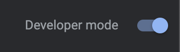
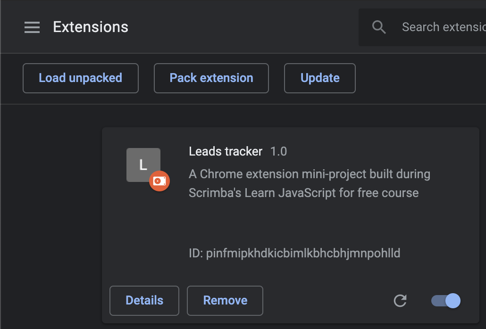

# Scrimba's Google Chrome Extension Mini-Project

This mini-project was built during Scrimba's [Learn JavaScript for free course](https://scrimba.com/learn/learnjavascript).

It touches on many useful JavaScript features such as:

- Event Listenners
- Getting and Setting localStorage
- Template Strings
- Array Methods
- So much more (see link above to check it out)

## Setting Up This Chrome Extension

Download this repo and unzip it.

Then, open Google Chrome and go to `chrome://extensions/` to manage your extensions.

Here we'll start by toggling developer mode on.

At the top right of the page, there should be an option to toggle Developer mode on.

After activating Developer mode, we can load our chrome extension.

### Loading the Chrome Extension

Find the button at the top left of the page that says "Load Unpacked".

Click this button to upload the unzipped folder. This will load the extension to the browser.

At this point, the Chrome extension should be activated and ready to test!

### Testing the Leads Tracker Chrome Extension

Feel free to click around and play with this Leads Tracker extension.

It has three main functions:

1. Save Input - manually save URL
2. Save Tab - uses Google's `chrome.tabs` API to get current active window and active tab URL
3. Delete All - deletes all saved data

Thanks for reading!

## Supporting Scrimba

**The following text is from the Scrimba project file.s**

Since 2017, we have created over 20 free courses on Scrimba, and we're going to
continue launching free courses. But to pay our bills, we have to charge once
in a while. So if you've ever wanted to "give back" to Scrimba, you can do that by buying
one of our paid courses

- [Become a professional React developer](https://scrimba.com/course/greact)
- [The Responsive Web Design Bootcamp](https://scrimba.com/course/gresponsive)
- [The Ultimate JavaScript Bootcamp](https://scrimba.com/course/gjavascript)

  It would also mean the world to us if you share the courses.

Happy Coding!
